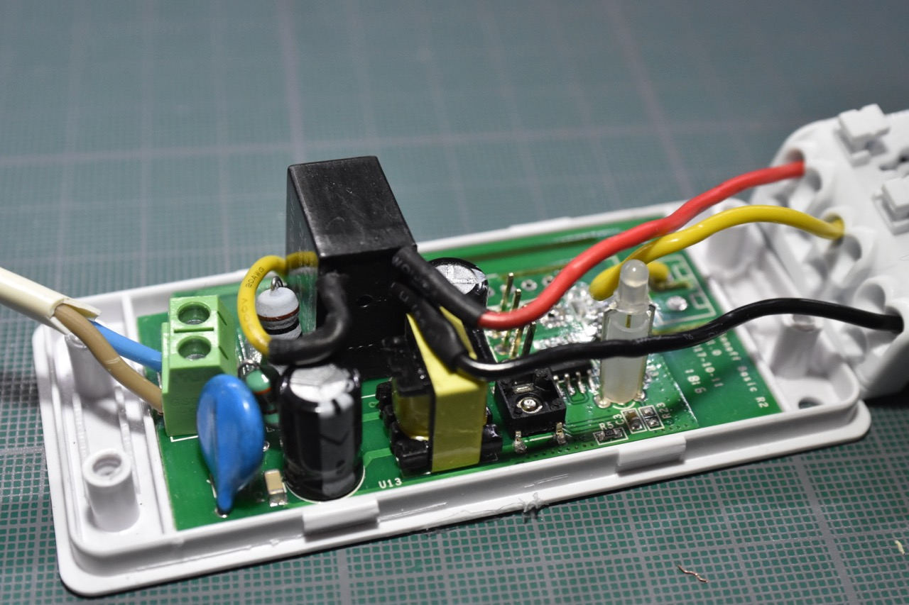
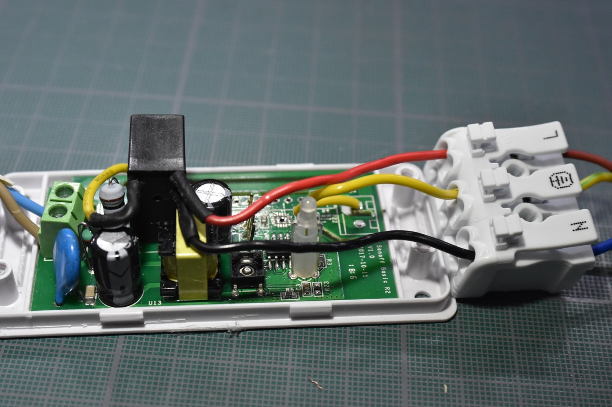

# DIY Automatic water shut off valve using Home Assistant

## Video demonstration:


[Youtube link](http://www.youtube.com/watch?v=Bhpk5eZIy3k "Demonstration")

After having flooded my downstairs neighbors, I added some [Xiaomi Aquara Water sensor](https://www.aqara.com/us/water_leak_sensor.html) to get some early warning in case of leaks. They've already proven useful but an alarm cannot do anything to stop a leak in progress by itself.

So I put together something simple to automatically shut the water off when a leak is detected.

## Bill of materials

* [Motorized Ball valve](https://amzn.to/2CDWZPb) The model will depend on your tubing diameter.
* [Sonoff Basic](https://sonoff.tech/product/diy-smart-switches/basicr2/) or [Zigbee equivalent](https://zigbee.blakadder.com/Ksentry_KS-SM001.html)
* [SPDT Relay](https://www.sparkfun.com/products/100)
* A [Home Assistant](https://github.com/home-assistant/home-assistant) installation with a MQTT server.
* Some water leak detector compatible with HA, I've used the previously mentioned Xiaomi sensors, but other will probably work just as well.

## Principle of Operation

The valve works in a simple manner: The yellow/green wire is tied to Neutral.
If the brown wire receive current, the valve will close.
If the blue wire receive current, the valve will open.

It has built-in endstops and will open/close all the way before stopping.


Those remote controlled relays like the Sonoff basic are extremely simple but there is a major flaw for this application:

They use a SPST-NO relay, and we need a SPDT relay. Fortunately, the fix is simple, just remove the relay and replace it with the one indicated above.



I've chosen to tombstone (install it vertically instead of laying down on the PCB) the new relay. It does have the disavantage of not being able to reuse the original enclosure as it doesn't fit vertically anymore. The coil pins are just bent and inserted in the previous holes.
The common pin is tied to the Line input.
The NO pin goes to the brown (close) wire of the valve.
The NC pin goes to the blue (open) wire of the valve.
The yellow/green wire of the valve is tied to neutral, using the hole of the output connector that I've removed.



## Software

On a Sonoff Basic, you can either install [Tasmota](https://github.com/arendst/Sonoff-Tasmota) or [ESPHome](https://esphome.io).

HA serves as a bridge between the water detector and the relay, here is the configuration for a Zigbee light controller:

```yaml
switch:
  # Custom device with a motorized ball valve and a modified zigbee switch to
  # create a connected main water valve. Documentation available here:
  # https://github.com/reefab/homeassistant-water-valve
  - platform: template
    switches:
      water_valve:
        value_template: "{{ is_state('light.valve', 'off') }}"
        turn_on:
          service: light.turn_off
          entity_id: switch.valve_1
        turn_off:
          service: light.turn_on
          entity_id: switch.valve_1

automation:
  - alias: Shut water valve in case of leaks
    trigger:
      - platform: state
        to: 'on'
        entity_id:
          - binary_sensor.leak_1
          - binary_sensor.leak_2
          - binary_sensor.leak_3
    action:
      service: switch.turn_off
      entity_id: switch.water_valve

homeassistant:
  customize:
    switch.water_valve:
      icon: 'mdi:pipe'
```

Do note that the on/off payload is inverted from the usual configuration as I want it to be "activated" only when a leak is detected.
